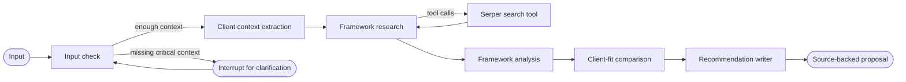

# AgentBridge

AgentBridge is a LangGraph-based research and integration advisor for selecting AI agent and RAG frameworks based on real product requirements. It turns a product question and client architecture context into current framework research, an evidence-aware comparison, and an actionable integration recommendation.

**Status: Working prototype.** The graph, live search tool, interrupt/resume flow, CLI, optional Gradio UI, checkpointing, structured intermediate artifacts, and deterministic test suite are implemented. Live recommendations require OpenAI and Serper credentials.

## Why it exists

Framework selection is rarely a feature checklist. The right choice depends on workflow control, state, data integrations, deployment constraints, human approval, observability, and the team's ability to operate the system. AgentBridge makes that decision process inspectable: research is separated from analysis, claims retain source URLs, and the recommendation is grounded in a structured client context rather than generic popularity.

## How it works



The input check can pause execution when critical requirements are absent. A follow-up resumes the same checkpointed LangGraph thread. Research can make at most two search calls; normalized results feed a separate fact-extraction pass before framework profiling and comparison.

## Example

The following is an **illustrative request and output shape**, not a captured model response.

**Input**

```text
We need a framework for a Python customer-support agent that searches product docs,
queries PostgreSQL, and requires human approval before account changes. We deploy on
AWS, need traceable decisions, and have a four-person backend team.
```

**Output structure**

- extracted company, stack, data-source, workflow, security, and team constraints;
- researched framework sources and claims;
- framework profiles covering orchestration, RAG, tools, state, human-in-the-loop, and operations;
- a scored client-fit comparison with trade-offs and confidence;
- a source-linked primary recommendation and alternatives;
- integration proposal, risks, mitigations, and measurable 2–4 week PoC criteria.

## Architecture

- **Graph nodes:** `input_check` validates critical context; `client_context_extractor` creates requirements; `framework_research` plans tool calls and extracts evidence; `framework_analyst` creates candidate profiles; `comparison` scores fit; and `recommendation_writer` renders the decision.
- **State:** `AgentBridgeState` is the graph contract. Messages use LangGraph's message reducer while durable artifacts—context, sources, facts, profiles, comparison, and final answer—have explicit fields.
- **Tools:** `search_web` wraps Serper. It bounds results, rejects malformed/non-HTTP entries, classifies source types, normalizes snippets, and converts provider exceptions into a safe tool result the graph can reason about.
- **Source validation:** model-produced facts are retained only when `source_url` exactly matches a normalized research source. Sources are URL-deduplicated and capped before downstream analysis.
- **Checkpointing:** the compiled graph uses a checkpointer (in-memory by default), enabling `interrupt`/`Command(resume=...)` clarification without restarting research.
- **Prompts:** prompts live separately from graph orchestration and assign narrow responsibilities to each model call. Pydantic schemas constrain every intermediate model response except the final Markdown presentation.
- **Structured outputs:** requirements, sources, facts, framework profiles, and comparison scores are validated by Pydantic before entering graph state.

## Running locally

Requires Python 3.12+ and [uv](https://docs.astral.sh/uv/).

```bash
cp .env.example .env             # add OPENAI_API_KEY and SERPER_API_KEY
uv sync --group dev
uv run agentbridge "Choose an agent framework for a Python support platform using PostgreSQL and AWS, with human approval for writes and a small backend team."
```

LangSmith tracing is optional. To enforce tracing configuration, add its values to `.env` and pass `--require-langsmith`.

Optional web UI:

```bash
uv sync --extra ui
uv run --extra ui agentbridge-gradio
```

If credentials are absent, the CLI exits with an actionable setup message rather than an SDK traceback.

## Tests

The suite exercises graph routing and compilation, state/result helpers, configuration validation, search normalization and provider failures, and source-to-claim validation without making network or model calls.

```bash
uv run --group dev ruff check .
uv run --group dev pytest --cov=agentbridge --cov-report=term-missing
```

GitHub Actions runs both checks for pushes and pull requests.

## Limitations / roadmap

- Recommendations depend on search freshness and model judgment; source matching prevents unattached claims but does not independently prove that a source entails every claim.
- The default in-memory checkpointer is appropriate for a demo process, not cross-process durability. A production deployment should inject a persistent checkpointer.
- Uploaded document IDs are represented in state, but document ingestion/retrieval is not yet implemented.
- The live workflow currently supports OpenAI plus Serper rather than a provider-neutral runtime configuration.
- A future evaluation set should measure citation correctness, ranking stability, and recommendation quality across representative client briefs.

## Repository layout

```text
src/agentbridge/   Package: graph, schemas, prompts, tools, runtime, CLI, and UI
tests/             Deterministic unit and graph-wiring tests
notebooks/         Package-backed manual exploration
docs/archive/      Historical migration notes, outside the primary project path
.github/workflows/ Continuous integration
```
